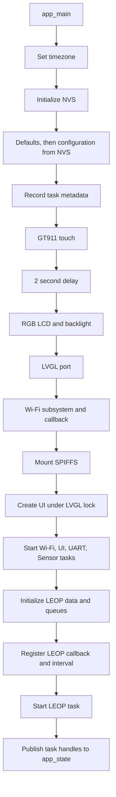
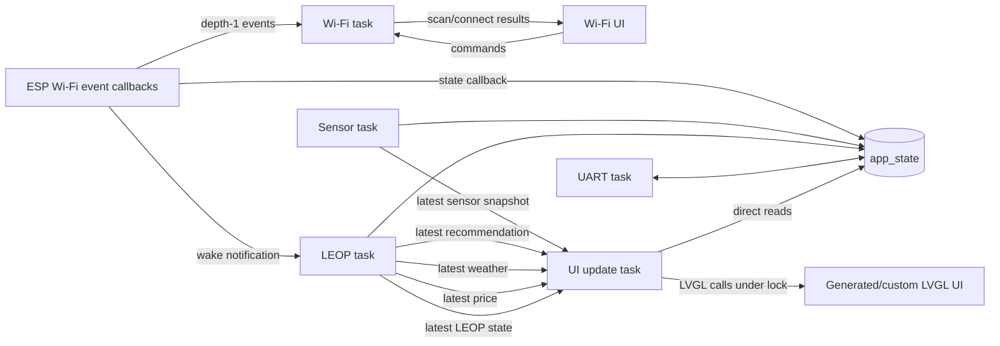

# Glennergy-ESP firmware architecture

| Metadata | Value |
| --- | --- |
| Status | Current implementation with known limitations |
| Audience | Firmware developers, maintainers, and technical reviewers |
| Canonical owner | Glennergy-ESP |
| Applicability | Authoritative `dev`; stable-production differences require separate validation |
| Last source verification | Glennergy-ESP `b5a502a` |
| Evidence type | Static source inspection; no runtime or hardware validation |

Glennergy-ESP is ESP-IDF firmware for an ESP32-S3-based display unit. It reads
the local BME280 environment sensor, manages Wi-Fi, fetches LEOP data from the
Glennergy server, presents current snapshots through an LVGL interface, and
provides a UART diagnostic shell. The application is organized around five
long-running FreeRTOS tasks and a process-wide `app_state_t` object.

For the whole-system boundary, see [System context](system-context.md). For the
current HTTP contract, see [Glennergy interface contract](interface-contract.md).
Known partial and planned behavior is collected in
[Current limitations](current-limitations.md).

## Startup and initialization

`app_main()` owns system bring-up. The verified initialization order is:

1. Set the process timezone to the Central European time rule and call
   `tzset()`.
2. Initialize NVS.
3. populate configuration defaults, then replace available values from NVS;
4. populate intended task metadata names and configured stack sizes in
   `app_state_t`;
5. initialize the GT911 touch controller, wait two seconds, initialize the RGB
   LCD, enable its backlight, and initialize the LVGL port;
6. initialize Wi-Fi and register the application Wi-Fi-state callback;
7. mount SPIFFS;
8. acquire the LVGL lock and create the UI with `ui_init()`;
9. create the Wi-Fi, UI, UART, and Sensor tasks;
10. initialize the LEOP data containers and four LEOP queues, register the LEOP
    state callback, connect its fetch interval to application configuration,
    and create the LEOP task;
11. copy the five resulting task handles into `app_state_t` for diagnostics.

This sequence describes code order, not proof that every peripheral or task
successfully starts on physical hardware. Some initialization calls are guarded
by `ESP_ERROR_CHECK` and abort on error, while several return values—most
notably task creation and `LEOPFetcher_Initialize()` in `app_main()`—are not
checked before startup proceeds. A queue-allocation failure is logged by its
own module but does not produce one coordinated application-startup failure.

## Application tasks

The task names, stack sizes, priorities, and arguments below come from
`main/main.c`. ESP-IDF stack-size arguments are expressed in bytes on the
supported ESP-IDF port; the table retains the exact configured values.

| Intended metadata name | Entry point | Stack | Priority | Argument | Primary responsibility |
| --- | --- | ---: | ---: | --- | --- |
| `WIFI_Work` | `WiFi_Work` | 8192 | 5 | `NULL` | Wi-Fi credentials, scans, connect/disconnect commands, events, and reconnect attempts |
| `UI_Update` | `ui_update_task` | 16384 | 5 | `&app` | Poll snapshots and update widgets; most tab updates use an outer lock, but the Wi-Fi connected-result path is currently unlocked |
| `UART` | `UART_Work` | 4096 | 4 | `&app` | Blocking UART input and diagnostic/configuration commands |
| `Sensor` | `Sensor_Work` | 4096 | 4 | `&app` | Initialize and periodically read the active BME280 V2 wrapper |
| `LEOP` | `LEOPFetcher_Work` | 4096 | 4 | `&app.leop_data` | Fetch, cache, health-check, and publish server data and LEOP state |

The table gives the intended names stored in task metadata. The UART and Sensor
creation calls currently pass `&app.system_task_handlers.<task>.name` instead
of the `char *` value. That pointer-to-pointer is incompatible with
`xTaskCreate`'s task-name parameter and can produce an invalid or garbage
runtime task name. Wi-Fi, UI and LEOP pass their name values correctly. This is
a current implementation defect, not a naming convention.

The Wi-Fi and UI tasks have higher configured priority than UART, Sensor, and
LEOP. The code does not pin these tasks to specific cores. ESP-IDF system tasks,
LVGL internals, event-loop callbacks, and driver activity also run outside this
five-task application table.

## Data ownership and communication

### Shared application state

`main/main.c` owns one static `app_state_t`. It contains:

- LEOP response containers and fetch configuration;
- the latest sensor reading;
- persistent/runtime configuration;
- Wi-Fi, LEOP, and sensor status fields;
- task names, stack sizes, and handles used by diagnostics.

Ownership is distributed rather than enforced by one state-owner task:

- Wi-Fi and LEOP callbacks update connectivity flags;
- Sensor writes `sensor_data` and reads `config_data.sensor_interval_ms`;
- LEOP writes `leop_data` and reads the fetch-interval value through a pointer;
- UI and UART read multiple sections;
- UART configuration commands can update configuration and persist it to NVS.

There is no common mutex around `app_state_t`. The queues described below give
selected consumers copied snapshots, but they do not synchronize direct reads
and writes to the shared object. The LVGL port lock protects LVGL calls; it is
not an `app_state_t` lock. This is a concurrency limitation, not evidence that
a race has been reproduced at runtime.

### Queues and notifications

| Queue/notification | Created by | Producer | Consumer | Current semantics |
| --- | --- | --- | --- | --- |
| `Sensor_Queue` | Sensor task initialization | Sensor task | Home/Sensor UI | Depth 1; `xQueueOverwrite` keeps the latest sensor snapshot |
| `recommendation_queue` | LEOP initialization | LEOP task | Electricity UI | Depth 1; latest complete `RecommendationList` snapshot |
| `weather_queue` | LEOP initialization | LEOP task | Weather UI | Depth 1; latest complete `WeatherList` snapshot |
| `price_queue` | LEOP initialization | LEOP task | Price UI | Depth 1; latest complete `PriceList` snapshot |
| `leop_status_queue` | LEOP initialization | LEOP task | UI update task | Depth 1; latest changed LEOP state, published with overwrite |
| Wi-Fi event queue | Wi-Fi initialization | ESP event callbacks | Wi-Fi task | Depth 1; event handoff uses a mixture of overwrite and non-blocking send |
| Wi-Fi command queue | Wi-Fi initialization | Wi-Fi UI | Wi-Fi task | Depth 1; non-blocking commands, so a full queue can reject a new command |
| Wi-Fi result queue | Wi-Fi initialization | Wi-Fi task | Wi-Fi UI | Depth 1; scan/connect results; delivery uses both overwrite and non-blocking send |
| LEOP task notification | `app_main()` callback path | Wi-Fi-state callback | LEOP task | Wakes the LEOP task promptly when Wi-Fi state changes |

“Latest-value” applies directly to the queues written with
`xQueueOverwrite`: an intermediate snapshot may be replaced before the UI
consumes it. It must not be generalized to all Wi-Fi commands/results, because
several of those paths use zero-wait `xQueueSend` instead.

The arrows show logical communication and omit ESP-IDF driver/event-loop
internals. Queue payloads are copied values, while arrows to `app_state_t`
represent direct shared-memory access.

## Module boundaries

### Wi-Fi

The Wi-Fi module owns ESP-IDF station initialization, its internal event group,
event/command/result queues, credential loading and saving, scans, connection
requests, and delayed reconnect attempts. ESP event callbacks update internal
connection state and invoke the registered callback. The callback in
`main/main.c` mirrors that state to `app.system_status.wifi_connected` and wakes
the LEOP task.

Wi-Fi credentials are loaded from and written to NVS. They are sensitive data
and are intentionally not included in this architecture document.

### Sensor

The Sensor task owns periodic sampling through `hal::BME280SensorV2`. It starts
after a three-second task-local delay, attempts initialization, and continues
periodic reads even when the sensor was unavailable initially. Successful reads
update shared sensor state and publish a depth-one snapshot. Failed V2 reads
mark the state invalid and publish that invalid snapshot. Reconnection details
belong in the hardware and troubleshooting documentation.

The older `BME280Sensor` V1 code remains compiled/referenced in the module but
its active instantiation and read call are commented out. It is not the current
sensor path.

### LEOP

The LEOP task owns remote recommendation, weather, and price fetching, the
corresponding SPIFFS cache flow, connection-health state, and its four UI-facing
queues. With Wi-Fi available it fetches all three categories synchronously and
classifies the result as connected, degraded, or failed. With no Wi-Fi it loads
each cache once per offline period. It performs health probes between full
fetches and is woken early by Wi-Fi changes.

This is currently an ESP-initiated, read-only HTTP flow. Property registration,
UUID-like device identity, authentication, and server writes are planned but
not implemented. Exact endpoints, payload constraints, timeout and cache
behavior are canonical in [the interface contract](interface-contract.md).

### UI and generated-code boundary

SquareLine Studio generated the base LVGL project and screen files under
`ui/`. The current `ui/screens/ui_Screen1.c` also acts as application UI
orchestration: it initializes tab modules and its update task calls their
update functions approximately every 50 ms. Most tab widget updates occur under
the UI task's outer LVGL port lock. `WiFi_UI_Update()` runs before that outer
lock. Its scan-result branch acquires its own lock, but its connected-result
branch directly changes labels and text colors without acquiring the lock. This
unlocked path is a current concurrency defect and must not be described as
serialized LVGL access.

Files carrying generated headers or large generated/commented regions should
be treated as regeneration-sensitive. Application-specific tab modules and
event callbacks are coupled to generated object names. Regenerating or editing
the SquareLine output can therefore affect custom UI code even when C symbols
still compile. Generated UI cleanup or regeneration is a separate reviewed
change, not part of this architecture description.

### UART

The UART task initializes the console and blocks waiting for input bytes. Its
diagnostic shell reads shared status, sensor, LEOP, configuration, and task
metadata. Configuration commands can update the shared configuration and NVS,
so UART is not purely read-only. Command syntax and persistence behavior are
documented in [UART commands](UART_COMMANDS.md).

## Failure and recovery boundaries

| Area | Current handling | Boundary or limitation |
| --- | --- | --- |
| Startup | Several hardware/driver calls use `ESP_ERROR_CHECK`; other failures are logged | Task creation and LEOP initialization results are not coordinated or checked by `app_main()` |
| Wi-Fi | Event-driven state, saved-credential startup, and delayed reconnect attempts | The UI may retain a connected color after loss; queue sends can be dropped when full |
| LEOP transport | Partial success becomes degraded; repeated total failures become unavailable; health retry is faster after failure | Plain HTTP, no API authentication, no dedicated health endpoint, and no individual fetch retry |
| LEOP cache | Cached snapshots are loaded once per offline period | Malformed online responses do not automatically fall back to cache; raw bodies can replace cache before validation |
| Sensor | Failed reads publish an invalid snapshot; V2 wrapper periodically attempts recovery | No campaign hardware observation proves recovery timing or electrical behavior |
| UI | Most tab updates use the LVGL lock; Wi-Fi scan results lock internally | Wi-Fi connected-result widget changes are unlocked; direct shared-state reads remain unsynchronized; generated/custom boundary is fragile |
| UART | Input loop remains available for inspection and configuration | Commands share live state without a common mutex; some commands can persist or reboot |

Recovery guarantees should not be inferred beyond these code paths. In
particular, static inspection cannot prove network availability, display/touch
operation, sensor reconnection, timing under load, or recovery on a physical
ESP32-S3.

## Inactive, fake, and legacy paths

The following are tracked as cleanup candidates rather than active
architecture or deletion-authorized code:

- `main/LEOP/leop.cpp` and `main/LEOP/fake_leop.*`, superseded in current
  startup by `LEOPFetcher_Work`;
- `main/fake/*` and `main/sensor/fake_sensor.*`, whose active calls were not
  found during discovery;
- the older `main/hal/bme280_sensor.*` V1 path, while V2 is active;
- unused sample JSON in `main/main.c`;
- large commented legacy UI implementation blocks and possible duplicate or
  legacy source entries.

Static non-use is not enough to prove safe deletion in an embedded build.
Conditional compilation, registration mechanisms, generated references, and
teaching/test intent must be checked before cleanup. See the
[cleanup candidate register](documentation_campaign/CLEANUP_CANDIDATES.md) for
the current evidence and next verification steps.

## Stable-production applicability

This document describes the architecture verified on authoritative `dev` at
`b5a502a`. The campaign recorded stable `origin/main` at
`daf35c538d84586576f8286c2d543eb1c3c89e6a`, but no production device or live
deployment was inspected. Shared files on `main` provide useful comparison
evidence; they do not prove that every task, queue, failure path, configuration,
or peripheral behavior documented here is running in production.

## Maintenance and verification

Re-check this document when any of these change:

- `app_main()` initialization or task creation;
- `app_state_t`, task metadata, queue payloads, depths, or producers/consumers;
- Wi-Fi callbacks, event handling, reconnect logic, or credentials;
- sensor implementation, bus ownership, sampling, or recovery;
- LEOP fetch, cache, health, state, route, or registration behavior;
- UART state/configuration access;
- UI generation workflow, object names, update cadence, or locking.

Primary static evidence:

- `main/main.c` — startup, callbacks, task creation, stack and priority values;
- `main/app_types.h` and `main/app_queues.h` — shared state and queue declarations;
- `main/WiFi.c` — Wi-Fi queues, worker, callbacks, persistence and reconnect;
- `main/sensor/sensor.cpp` — active sensor task and latest-value publication;
- `main/LEOP/LEOP_Fetcher.c` — LEOP queues, fetch/cache loop and state handling;
- `main/UART/UART.cpp` and `main/UART/uart_diag_shell.cpp` — UART ownership and
  shared-state/configuration access;
- `ui/screens/ui_Screen1.c` and `ui/Tabs/*` — UI orchestration and queue consumers.

Validation for this edition was limited to source inspection and documentation
checks. It did not flash firmware, open a serial device, contact the real VPS,
read secrets, run a production service, or interact with physical hardware.
