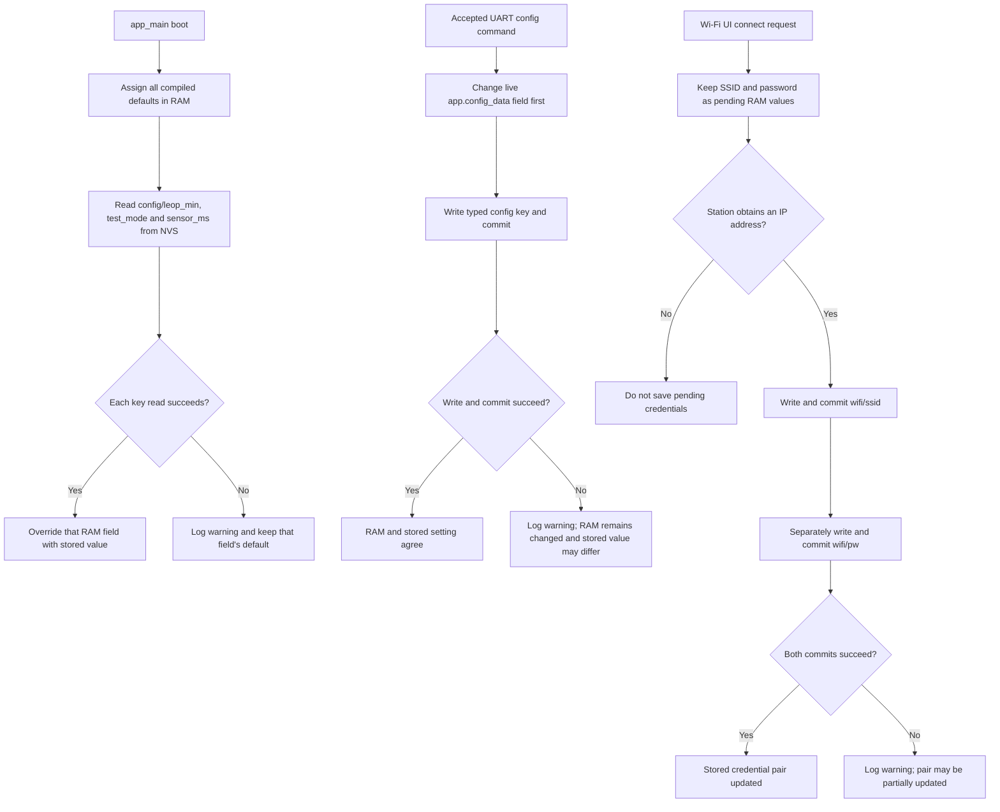

# Configuration guide

> **In short:** The firmware loads application settings and Wi-Fi credentials
> from the default ESP-IDF NVS partition, with defaults used when reads fail.

The firmware loads application settings and Wi-Fi credentials from NVS. This
page documents the implemented keys and mutation paths without exposing stored
values. For task and ownership context, see the
[firmware architecture](architecture.md).

## Application settings

At boot, `app_main()` calls `Config_SetDefaults()` and then
`Config_LoadFromNVS()`. A successfully read key replaces its default. A missing
or unreadable key is logged and leaves the already assigned default in memory.

| Runtime field | Namespace | Key | NVS type | Compiled default | UART accepted values |
| --- | --- | --- | --- | --- | --- |
| `fetch_interval_minutes` | `config` | `leop_min` | unsigned 32-bit integer | `1` minute | Integers `1` through `1440` |
| `test_mode` | `config` | `test_mode` | unsigned 8-bit value interpreted as Boolean | `false` | Exact text `true` or `false` |
| `sensor_interval_ms` | `config` | `sensor_ms` | unsigned 32-bit integer | `1000` ms | Integers `1000` through `60000` |

NVS namespace and key names are limited by ESP-IDF, which is why the persisted
names are shorter than the runtime fields.

### Settings UI mutation and persistence

The Settings tab offers sensor presets from 1 to 60 seconds and LEOP fetch
presets from 1 minute to 24 hours. An existing value outside those presets is
shown as a `Current` choice until a preset is selected. Applying a change
writes the new value to NVS first and updates RAM only for successful writes;
if one of two writes fails, the UI reports `Partially saved`.

### UART mutation and persistence

The diagnostic shell reads and writes the live `app.config_data` object:

```text
pconfig
config fetch_interval_minutes 15
config sensor_interval_ms 5000
config test_mode true
```

Each accepted `config` command changes the runtime value first and then calls
the corresponding NVS write helper. The NVS helper opens the namespace in
read/write mode, writes the typed key, commits, and closes it. If persistence
fails, the command logs a warning but does not roll the runtime value back.
Consequently the active value can differ from the value restored after reboot.

The LEOP task holds a pointer to `fetch_interval_minutes`, and the Sensor task
reads `sensor_interval_ms` on each loop. Accepted updates therefore affect
subsequent scheduling without a reboot. `test_mode` is persisted and printed,
but no active behavior controlled by it was established in the current source
review.

The UART shell accesses shared application state without a common mutex. See
[current limitations](current-limitations.md#shared-application-state).

## Wi-Fi credentials

| Value | Namespace | Key | NVS type | Buffer size including terminator |
| --- | --- | --- | --- | --- |
| SSID | `wifi` | `ssid` | String | 33 bytes |
| Password | `wifi` | `pw` | String | 65 bytes |

The Wi-Fi worker loads both strings on its first task entry. When both reads
succeed and the SSID is nonempty, it applies the station configuration and
starts a connection attempt. Credentials entered through the Settings/Wi-Fi UI
are held as pending values and are written to NVS only after the station obtains
an IP address. The SSID and password are committed separately, so an interrupted
or partially failed save is not atomic across the pair.

No credential values belong in source, documentation, screenshots, serial
logs, issues, or commits. NVS persistence is storage, not a claim that the
credentials are encrypted or access-controlled for the product threat model.
See [connectivity](connectivity.md) for the connection flow.

## Persistence flow



The three branches are related storage flows, not one transaction. Application
settings are loaded per key, UART changes RAM before persistence, and the Wi-Fi
SSID/password commits are separate. The diagram therefore does not promise
rollback, atomicity across values, or recovery of an interrupted credential
pair.

## NVS initialization and automatic erase

`app_main()` calls `NVS_Init()` before loading settings. If ESP-IDF reports
`ESP_ERR_NVS_NO_FREE_PAGES` or `ESP_ERR_NVS_NEW_VERSION_FOUND`, that helper
erases the entire default NVS partition, reinitializes it, and returns `-1`.
`app_main()` currently ignores that return value and continues, so application
settings and Wi-Fi credentials then fall back or fail to load. Other NVS
initialization errors pass through `ESP_ERROR_CHECK` and can abort/restart.

`WiFi_Initialize()` later calls `nvs_flash_init()` again and contains the same
erase-and-reinitialize handling for those two recoverable conditions. Because
the normal boot already initialized NVS, this is duplicate initialization
logic rather than a separate credential store.

The automatic erase is destructive but is already part of boot error recovery.
It is not equivalent to an operator-facing factory reset, and the firmware has
no reviewed UART command that deliberately erases NVS.

## Restart and erase boundaries

The UART command `reboot` immediately calls `esp_restart()`. It does not erase
NVS, clear Wi-Fi credentials, or restore defaults. It can interrupt outstanding
writes or network work and should be used only on an authorized development
unit.

`FullNVS()` is a compiled demonstration helper for a `storage` namespace
restart counter. It initializes NVS, may erase on the same initialization
errors, updates `restart_counter`, waits, and restarts. No call to `FullNVS()`
was found in the active startup or UART command path, so its `storage` keys are
not current application configuration.

Do not add or run a partition erase, factory-reset command, or bulk NVS dump
without explicit authorization and a recovery plan. Dumps can disclose Wi-Fi
credentials. Flashing firmware is also a hardware mutation; follow the safety
boundary in the [development guide](development.md#flash-and-monitor-a-development-board).

## Configuration change checklist

When adding or changing a setting:

1. Define its runtime type and safe default.
2. Assign a namespace, key, and exact NVS type.
3. Keep keys within ESP-IDF length constraints.
4. Specify validation in every mutation path, not only the UI or UART.
5. Decide whether a live update is safe or a reboot is required.
6. Handle NVS write failure without leaving an unexplained runtime/persisted
   split.
7. Avoid logging sensitive values.
8. Update this guide, UART documentation, tests, and migration behavior.

Property identity, UUID-like provisioning, authentication, and registration
are planned system work, not existing firmware configuration. Their current
boundary is recorded in [current limitations](current-limitations.md).

## Source map

<details>
<summary>Verification metadata</summary>

| Item | Value |
| --- | --- |
| Status | Current implementation |
| Storage | ESP-IDF NVS default partition |
| Last verified | Glennergy-ESP `693dc8819ac5b6d8fb29ce057d287814a3b9a14d` |

</details>

- `main/main.c` — default/load order and live interval pointer.
- `main/Config/AppConfig.*` — application defaults, keys, reads, and writes.
- `main/Config/WifiConfig.*` — credential keys and buffer sizes.
- `main/Memory/NVS.*` — typed NVS operations and initialization recovery.
- `main/UART/uart_diag_shell.cpp` — setter parsing, validation, persistence,
  reboot command, and printed configuration.
- `main/WiFi.c` — first-task credential load and post-IP save.
