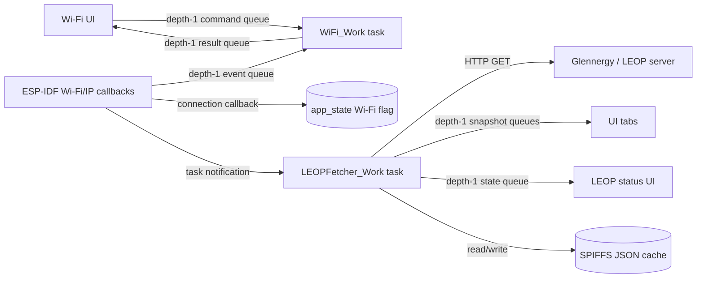
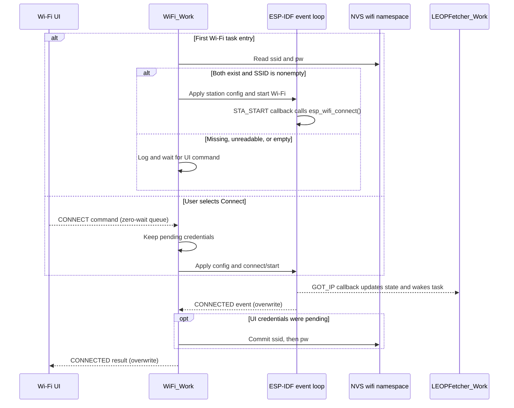
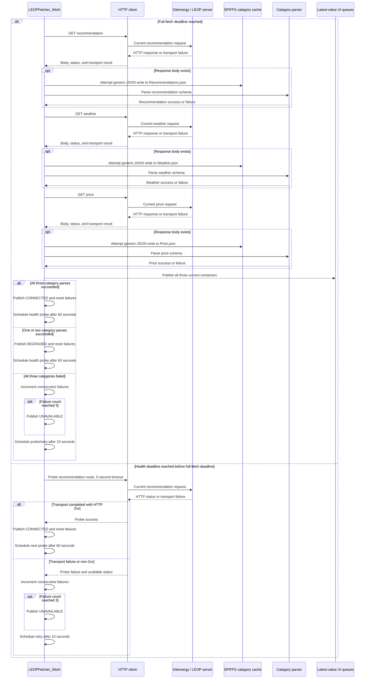
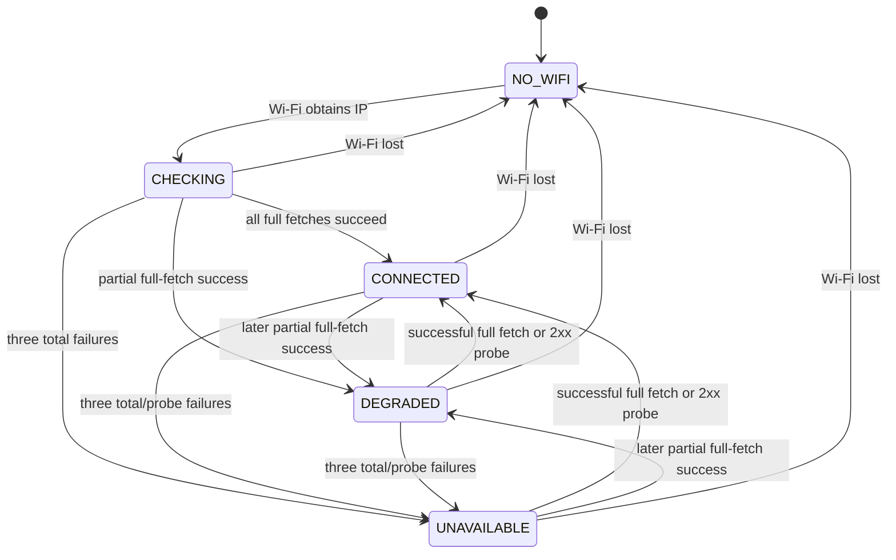
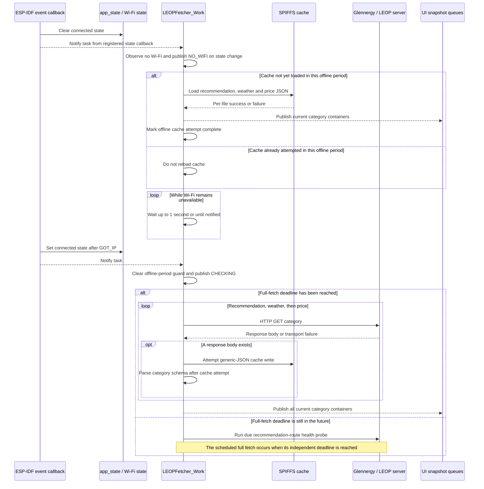

# Connectivity and data-flow guide

> **In short:** Wi-Fi events wake the LEOP task; it fetches three datasets,
> publishes the latest snapshots and attempts one cache load per offline period.

Glennergy-ESP connects as a Wi-Fi station and initiates read-only HTTP requests
to Glennergy, which acts as the LEOP server. Exact request grammar and payloads
are canonical in the [interface contract](interface-contract.md). This page
focuses on firmware scheduling, task/event contexts, state, retry, and cache
behavior.

Public documentation intentionally uses `<LEOP_BASE_URL>` and does not include
the configured VPS address.

## Quick model

1. Wi-Fi obtains an IP address and wakes the LEOP task.
2. LEOP fetches recommendation, weather and price in sequence.
3. Results become connected, degraded or unavailable state.
4. Received JSON may be cached before category validation.
5. After Wi-Fi loss, each cache is attempted once for that offline period.

Read the detailed queue and timing sections only when debugging scheduling,
reconnects, health checks or stale data.

## Runtime contexts and queues

Three execution contexts cooperate:

- ESP-IDF Wi-Fi/IP event callbacks update driver-facing state and enqueue
  selected status events.
- `WiFi_Work` handles UI commands, saved credentials, scans, connection
  results, credential persistence, and scheduled reconnect requests.
- `LEOPFetcher_Work` observes the Wi-Fi state, performs HTTP work, manages its
  cache flow, and publishes server data and LEOP state.



All three Wi-Fi queues have depth one, but they do not share one delivery
policy:

| Queue | Producer → consumer | Write behavior | Consequence |
| --- | --- | --- | --- |
| Command | Wi-Fi UI → Wi-Fi task | Zero-wait `xQueueSend` | A command can be rejected while the queue is full |
| Internal event | ESP event callbacks → Wi-Fi task | Connected uses overwrite; initialized/disconnected use zero-wait send | Connected replaces an older event; other events can be dropped |
| Result | Wi-Fi task → Wi-Fi UI | Connected uses overwrite; scan/disconnect use zero-wait send | Connected is latest-value; other results can be dropped |

The LEOP recommendation, weather, price, and state queues also have depth one,
but use `xQueueOverwrite`, so they carry the latest complete snapshot/state and
can replace an intermediate update before consumption.

The connection callback registered by `app_main()` runs synchronously from the
ESP-IDF Wi-Fi/IP event callback path. It updates the shared Wi-Fi flag and wakes
the LEOP task with a task notification. The LEOP connection callback, by
contrast, runs from LEOP worker task context when a changed state is
successfully published. Neither callback is a separate worker thread.

## Credential and connection flow



Obtaining an access-point association is not sufficient: the firmware marks
Wi-Fi connected on `IP_EVENT_STA_GOT_IP`. That callback also starts SNTP when
time is not synchronized; the current implementation can wait there for up to
about ten seconds, despite event callbacks being intended to stay short.

On disconnect, the callback clears the connected state and schedules up to 100
reconnect attempts. Delay grows by one second per attempt and is capped at
30 seconds. The Wi-Fi worker issues the delayed `esp_wifi_connect()` calls.
Only after the attempt counter is exhausted does the event path try to enqueue
`WIFI_STATUS_DISCONNECTED`. A newly obtained IP resets the counter.

The Wi-Fi UI consumes connected, reconnecting, and disconnected results and
offers an intentional disconnect button. Commands use zero-wait queue sends,
so the UI still cannot confirm delivery when the depth-one command queue is
full. See [current limitations](current-limitations.md#wifi-status-display).

## Current LEOP request boundary

With Wi-Fi available, the ESP is the only initiator. It performs three
unauthenticated plain-HTTP GET requests for hard-coded property ID `2`:

```text
<LEOP_BASE_URL>/id=2?recommendation
<LEOP_BASE_URL>/id=2?weather
<LEOP_BASE_URL>/id=2?price
```

These are the implemented transitional routes. The command-first route shape,
device registration, UUID-like identity, authentication, authorization, and
server writes are not implemented. See the [interface contract](interface-contract.md)
for exact current schemas and [current limitations](current-limitations.md) for
approved direction without invented design details.

Normal category GETs use a five-second transport timeout. Category code does
not require a successful HTTP status before using a received body. It validates
that the body is JSON before writing it to SPIFFS, but writes that generic JSON
cache before category-specific parsing. A syntactically valid but invalid
category payload can therefore replace a previous cache and then fail parsing.

## Fetch cadence and connectivity state

The LEOP task schedules its first full fetch immediately. Later full fetches
use the live `fetch_interval_minutes`; positive values are converted to minutes
and clamped to the RTOS tick range, while null/zero falls back to one minute.
An interval change affects scheduling after the next full-fetch deadline is
calculated; changing the value does not itself notify or reschedule the task.

Each full cycle fetches recommendation, weather, and price synchronously, then
publishes all three current containers:

| Result | State effect | Next health action |
| --- | --- | --- |
| All three succeed | `CONNECTED`, failure count reset | Probe after 60 seconds |
| One or two succeed | `DEGRADED`, failure count reset | Probe after 60 seconds |
| All three fail | Increment failure count | Probe/retry after 10 seconds; publish `UNAVAILABLE` at 3 failures |

The “health endpoint” is currently the recommendation GET route, not a
dedicated health resource. A probe has a five-second timeout and succeeds only
for an HTTP 2xx response. Probe success publishes `CONNECTED` and schedules the
next probe in 60 seconds. Failure increments the shared consecutive-failure
count, publishes `UNAVAILABLE` at three failures, and retries after 10 seconds.

State publication is change-only: if the state enum does not change, a new
status message is not queued and its updated failure count/status code is not
delivered. The full fetch deadline remains independent of the faster health
retry deadline.

### Current full-fetch and health sequence

The server exchange below is intentionally abstract. Exact temporary routes,
response fields, status behavior, and producer/consumer limitations belong in
the [interface contract](interface-contract.md).



Each category cache attempt happens before that category's schema parse. There
is no online cache fallback when a category fails. Publishing all three
containers after the fetch can therefore expose a mixture of newly parsed,
previous, empty, or failed-status data. A successful health probe changes
connection state but does not refresh all three datasets.



The diagram shows published state transitions, not every internal attempt.
Because publication suppresses duplicate states, `CHECKING` may remain the
last published state through early failures before the threshold is reached.

## Offline cache behavior

SPIFFS is mounted at `/spiffs` with `format_if_mount_failed = true`. Mount
failure can therefore format the SPIFFS partition. This is separate from NVS
and can remove cached LEOP JSON.

The three cache files are:

- `Recommendations.json`;
- `Weather.json`;
- `Price.json`.

When Wi-Fi is absent, the LEOP task attempts to load and publish all three cache
files once per continuous offline period. It then waits in one-second
notification-aware cycles. It does not repeatedly reload cache every second.
When Wi-Fi returns, the one-time guard is cleared; a later offline period can
load again.

Online category failures do not automatically fall back to the previous cache.
Cache loading is tied to the no-Wi-Fi branch. Cache success also does not mean
the server is connected: the published connection state remains `NO_WIFI`.

### Connection-loss and cache-recovery sequence



Loss of Wi-Fi does not guarantee that every cache file loads successfully; the
one-time guard records that the offline attempt occurred. Reconnection also
does not guarantee an immediate full fetch when its existing deadline has not
arrived. During a later full fetch, syntactically valid JSON can be written to
the category cache before category-specific parsing succeeds. A parse failure
does not trigger automatic fallback to the previous cache, and the current
containers published to the UI can therefore contain a mix of new, old,
empty, or failed-status data.

## Planned two-way registration

The intended future direction is for an ESP32-S3 unit to register property
information with Glennergy, which would persist validated property data. The
identity should become UUID-like and unique per unit rather than the temporary
increasing integer. The following remain unspecified and must not be inferred:

- UUID source and provisioning;
- device-to-property mapping and ownership;
- registration endpoint, request, and response schemas;
- authentication and authorization;
- retries, idempotency, conflict handling, migration, and recovery;
- validation and safe writes to the server property file.

That future state-changing flow requires a security and compatibility design
before implementation. It is not an extension of the current unauthenticated
GET behavior.

## Source map

<details>
<summary>Verification metadata</summary>

| Item | Value |
| --- | --- |
| Transport | ESP-initiated HTTP reads over the current LEOP interface |
| Applies to | Glennergy-ESP `dev` at `693dc8819ac5b6d8fb29ce057d287814a3b9a14d` |
| Verification boundary | Static source inspection; no live network, VPS, or hardware testing |

</details>

- `main/WiFi.*` — station lifecycle, queues, event callbacks, credential flow,
  and reconnect scheduling.
- `main/main.c` — Wi-Fi callback, LEOP wake notification, and interval pointer.
- `main/LEOP/LEOP_Fetcher.*` — fetch/state cadence, health probes, cache loading,
  and latest-value queues.
- `main/HTTP.*` — GET/probe timeout and status handling.
- `main/LEOP/Recommendation.c`, `Weather.c`, and `Price.c` — category cache and
  parsing order.
- `main/Memory/Spiffs.*` and `main/Cache/*` — cache persistence.
- `ui/Tabs/Wifi/WiFi_UI.c` — command producer, result consumer, and UI behavior.
