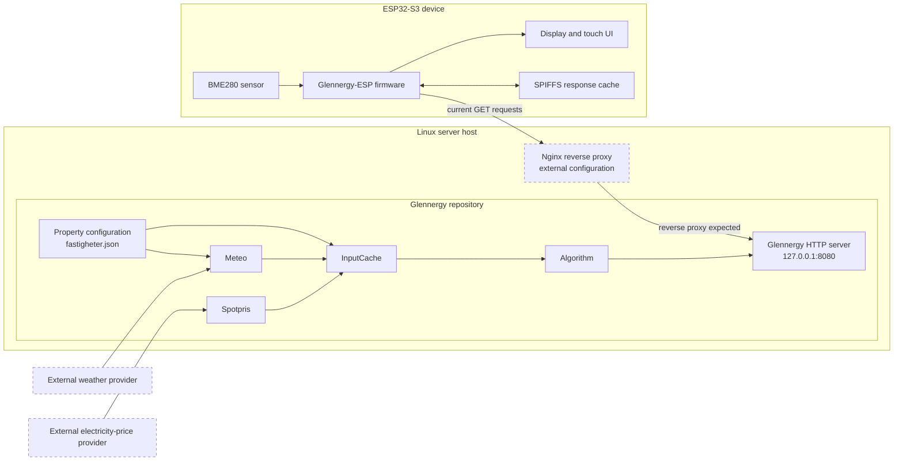

# Glennergy system context

> **In short:** Glennergy is the LEOP server; Glennergy-ESP is the display
> firmware. The current connection is read-only HTTP initiated by the ESP.

This document explains how the two repositories form one system. It is an
orientation guide. Start here for the overall picture, then follow links to the
API or repository-specific architecture only when you need implementation
detail.

The implementation statements below were verified against the authoritative
`dev` snapshots. The stable-production commits are recorded for traceability,
but differences between every `dev` feature and the deployed system have not
been independently runtime-tested. In particular, this document does not claim
that a successful local build proves the production deployment state.

## Purpose and scope

Glennergy combines a Linux server stack with firmware for an ESP32-S3 device:

- **Glennergy** is the LEOP server. It collects weather and electricity-price
  inputs, calculates quarter-hour result data, and serves recommendation,
  weather, and price datasets over HTTP.
- **Glennergy-ESP** is the device firmware. It connects to Wi-Fi, requests the
  datasets from Glennergy, stores received response bodies for possible offline
  use,
  reads a local BME280 sensor, and presents information through its UI and UART
  diagnostic interface.

In this project, **LEOP** means the Glennergy-facing service integration. Its
full expansion is not established in repository evidence, so this documentation
does not invent one.

This overview covers components implemented in the two repositories. No other
implemented application component is currently known. Internet connectivity,
external data providers, the ESP32-S3 hardware, and the production reverse
proxy are dependencies or boundary components rather than code owned here.

## How the projects currently interact

The implemented application-level interaction is one-way in responsibility:
Glennergy-ESP requests data and Glennergy returns it. It is ordinary HTTP
request/response traffic, so network packets travel in both directions, but
the ESP cannot currently register a device or property, update server-side
property information, or receive server-initiated commands.

The firmware currently makes three unauthenticated `GET` requests using a
temporary, hard-coded property ID of `2`:

```text
GET <LEOP_BASE_URL>/id=2?recommendation
GET <LEOP_BASE_URL>/id=2?weather
GET <LEOP_BASE_URL>/id=2?price
```

`<LEOP_BASE_URL>` deliberately replaces the deployment-specific address. The
current firmware transport is plain HTTP and the API has no authentication or
authorization. Those are current security limitations, not recommended
properties of a future state-changing API.

Parseable responses are copied into fixed-size firmware structures and
published as latest-value snapshots for the UI. Received non-null bodies are
written to SPIFFS before schema validation, so a malformed or incompatible body
can overwrite the previous cache. Offline display succeeds only if the stored
body can later be parsed. Exact schemas, response behavior, parsing limitations,
fetch cadence and cache rules belong in the
[interface contract](interface-contract.md). Wi-Fi, health, retry and cache
details are maintained in the [connectivity guide](connectivity.md).

## System boundary



At a high level, timer-triggered Glennergy producers obtain external weather
and price inputs. `InputCache` aggregates those inputs through local IPC. The
`Algorithm` process calculates result arrays and publishes a shared-memory
snapshot, and the HTTP server reads that snapshot to answer requests. The
server stack contains five executables: InputCache, Meteo, Spotpris, Algorithm,
and the HTTP server.

On the device, the firmware runs Wi-Fi, UI, UART, Sensor, and LEOP tasks. The
LEOP task performs the server requests; local queues and shared application
state carry the newest values to consumers. See [firmware architecture](architecture.md)
for task, queue, startup and ownership details. Server process and IPC details
are maintained in Glennergy's
[server architecture](https://github.com/Glennergy-Optimizer/glennergy/blob/dev/Docs/architecture.md).

## Deployment and evidence boundary

The Glennergy HTTP process binds to the loopback address at
`127.0.0.1:8080`. Repository service definitions and deployment documentation
expect Nginx to form the externally reachable boundary and proxy requests to
that loopback service.

The Nginx configuration, public TLS termination, firewall configuration, DNS,
and production network policy are outside the two repository snapshots.
Consequently, their presence and correctness cannot be established from this
code alone. This document does not publish the real VPS address and does not
claim that external TLS or access controls have been verified.

The external weather and electricity-price services are also outside this
documentation's implementation authority. Their contracts should be described
only where the Glennergy adapters provide evidence, and operational availability
requires separate observation.

## Current limitations

The following are part of the current or temporary system state:

- **Temporary property selection:** the ESP requests property ID `2`; users
  cannot select or register a property from the device.
- **Temporary capacity:** important server structures currently process at most
  five properties. This is a test limit, not the intended final capacity.
- **Temporary example data:** the server repository contains premade property
  data, including entries that are not all valid for current consumers.
- **Recommendation policy still under review:** the implemented interface now
  separates a continuous `score` from an explicit quartile-based buy/hold/sell
  `recommendation`, but the final product meaning and presentation policy
  remain deliberately unresolved.
- **Read-only, unauthenticated integration:** no registration or property-write
  route exists, and the current GET API uses plain HTTP without API
  authentication or authorization.
- **Partial device UI:** four of five Settings fields work; System Status
  remains the `Starting...` placeholder. Wi-Fi now displays connected,
  reconnecting, and disconnected states, although depth-one command delivery
  can still fail without user-facing feedback.
- **Compatibility and resilience gaps:** timestamp offsets can be truncated by
  the ESP. Glennergy serializes UV as a JSON real after earlier integer
  conversion, while the ESP reads it with `json_integer_value`; the current
  consumer can therefore store zero. Malformed online responses do not trigger
  a cache fallback.
- **Verification boundary:** repository analysis and available tests do not
  constitute full production, hardware, or end-to-end runtime verification.

See [current limitations](current-limitations.md) for the maintained list and
the evidence or verification status of each item.

## Planned completion work

The following describes direction, not implemented behavior:

- Replace the current route shape with a conventional form such as
  `/recommendation?id=2`. The current server does **not** accept that route, so
  migration requires a compatibility plan and coordinated changes.
- Add two-way application behavior so an ESP32-S3 unit can register property
  information and Glennergy can persist it safely.
- Introduce a UUID-like identity unique to each ESP32-S3 unit and design how it
  maps to the temporary integer property ID. Whether either identifier replaces
  the other is not yet decided.
- Complete the two Settings fields, correct the Wi-Fi disconnect display, and
  clean up confirmed obsolete code and comments through separate code changes.

No registration payload, UUID source, identity-to-property mapping,
authentication method, authorization rules, retry/idempotency behavior, or
atomic persistence design has been approved. Those details must be designed and
security-reviewed before documentation can describe a final protocol.

## Where to go next

- [Cross-project interface contract](interface-contract.md) — current routes,
  schemas, errors, and producer/consumer compatibility.
- [Shared glossary](glossary.md) — project terms, legacy identifiers, units,
  and unresolved terminology.
- [Firmware architecture](architecture.md) — startup, tasks, queues, shared
  state, and module ownership.
- [Connectivity and cache behavior](connectivity.md) — polling, health states,
  caching, and recovery.
- [Current limitations](current-limitations.md) — current, partial, temporary,
  planned, and unverified behavior.
- [Glennergy server architecture](https://github.com/Glennergy-Optimizer/glennergy/blob/dev/Docs/architecture.md)
  — server processes, IPC, schedules, and data ownership.

## Maintenance

<details>
<summary>Verification metadata</summary>

| Item | Value |
| --- | --- |
| Owner | Glennergy-ESP documentation |
| Applies to | Authoritative `dev` branches in both repositories |
| Glennergy-ESP snapshot | `baf9b58d04e827f024c8975b140f7a417e462370` |
| Glennergy snapshot | `0048c08ed01fa385d114cd3461e2cad9d7aceb73` |
| Verification boundary | Static repository inspection; no production or hardware access |

</details>

Recheck this document when either repository adds a system component, changes
communication direction or transport, changes the deployment boundary,
implements property registration, or adopts new canonical terminology. Update
both last-verified SHAs whenever the cross-project claims are revalidated.
