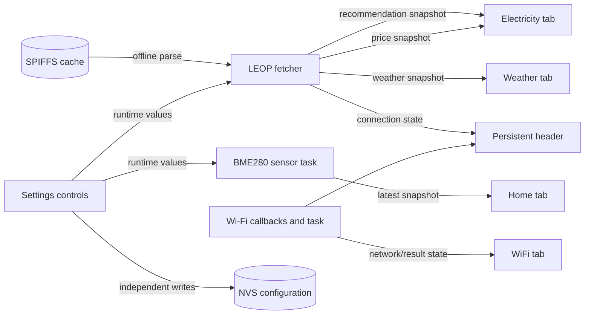

# User interface guide

> **In short:** The UI has five tabs. Home, Electricity, Weather and WiFi show
> current snapshots; Settings shows device state and can persist update-interval
> presets.

The firmware presents one main LVGL screen with five tabs: **Home**,
**Electricity**, **Weather**, **WiFi**, and **Settings**. A persistent header
shows the Glennergy name, the selected/current Wi-Fi network text, and LEOP
connection state.

This guide describes what current code intends to display. It does not claim
that layout, touch coordinates, colors, timing, or peripheral behavior have
been observed on a physical panel.

## Tab overview

| Tab | Main purpose | Important limitation |
| --- | --- | --- |
| Home | Local BME280 temperature, humidity and pressure | Freshness depends on sensor validity |
| Electricity | Recommendation chart and electricity-price list | Data freshness is not shown |
| Weather | Forecast snapshot | Timestamp and UV compatibility gaps apply |
| WiFi | Scan, connect, reconnect and disconnect | Queue delivery can fail without UI feedback |
| Settings | Device status plus sensor/LEOP interval configuration | System Status remains a placeholder |

The diagram distinguishes data producers from presentation. Queue snapshots do
not by themselves prove freshness, and applying both Settings intervals can
partly succeed because each value is persisted independently.

## Header status

### Wi-Fi name

The header starts as `Not Connected`. It shows the loaded or selected SSID
after connection, `Reconnecting` during automatic recovery, and `No WiFi` after
an intentional disconnect or exhausted reconnect scheduling.

### LEOP state

The LEOP label consumes the latest changed state from a depth-one queue:

| Text | Color | Meaning in current firmware |
| --- | --- | --- |
| `No WiFi` | Red | Wi-Fi is unavailable |
| `Checking...` | Yellow | Wi-Fi became available and LEOP is being checked |
| `Connected` | Green | All three fetches succeeded, or a later health probe succeeded |
| `Degraded` | Orange | At least one, but not all, full-fetch categories succeeded |
| `Not connected` | Red | Repeated total fetch/probe failures reached the threshold |

The label reports the LEOP task's connection classification, not freshness of
each displayed value. A health probe currently reuses the recommendation route
and can change a prior degraded state to connected without refetching all three
datasets. Cached data can also remain visible while offline.

## Home tab

The Home tab displays the latest BME280 temperature, relative humidity, and
pressure in three gauges, plus a latest-data message.

- A valid Sensor queue snapshot replaces all three numeric labels.
- An invalid snapshot leaves the previous numeric values visible and updates
  the latest-data message instead.
- Before any successful reading, the message is `Latest data: unavailable`.
- When wall time is valid, the message can include local date/time and elapsed
  monotonic age; otherwise it reports elapsed age only.

The displayed pressure label includes `hPa`; temperature and humidity formatting
comes directly from the current module. Static inspection does not establish
sensor accuracy or the physical units supplied by every lower-level boundary.

## Electricity tab

The left panel displays every available recommendation entry, up to 128,
normalized to 0–100 for bar height. Bar colors use LEOP's separate quartile
category: green for buy, yellow for hold, red for sell, and gray for unknown.
Twelve labels are distributed across the received time range.

The right panel shows a simultaneously visible, scrollable list of up to 32
hourly prices in SEK/kWh, sampled every fourth item from the received list.

## Weather tab

The active path is the newer weather dashboard (`weather_dashboard_create` and
`Weather_UI_Update_test`), despite the testing-style function name. It creates:

- a current-weather card using the first weather entry;
- a text description and icon selected from the weather code;
- a scrollable 24-hour forecast list sampled every fourth entry, with time,
  temperature, icon, and code-derived presentation.

The icon mapping covers clear/partly cloudy, overcast/fog, drizzle/rain,
heavy rain/thunderstorm, and snow/freezing-weather WMO code groups. Unknown
codes fall back to the cloud icon.

The older `Weather_UI_Initialize`/`Weather_UI_Update` path remains in source but
is not called by current screen startup. Weather values update only when a
queue snapshot is marked fetched. Cached and network-fetched snapshots are not
visually distinguished.

## WiFi tab

The WiFi tab provides:

- a scan button;
- a network dropdown populated from the latest scan result;
- a password-mode text area and on-screen keyboard;
- a disconnect button;
- a status label initialized as red `Disconnected`.

Selecting a network updates the selected SSID. Pressing OK on the password
keyboard submits a non-blocking, depth-one connect command. Scan and connect
commands can be dropped if that queue is full; the UI does not currently show a
delivery error.

The tab consumes connected, reconnecting, and disconnected results and updates
both its status and the header. The disconnect button sends an intentional
disconnect command; that path suppresses automatic reconnect for the requested
disconnect. Queue sends are non-blocking, so a full command queue can still
drop a scan, connect, or disconnect request without user-facing delivery error.

Passwords are stored through the Wi-Fi module's NVS path after a successful
connection. Do not expose the password field, NVS contents, or logs/screenshots
containing network details.

## Settings tab

The Settings status panel contains five rows. Four have live/current behavior:

| Field | Current behavior | Status |
| --- | --- | --- |
| Uptime | Re-formatted from monotonic device uptime once per second | Implemented |
| Last restart reason | Set once from `esp_reset_reason()` during UI initialization | Implemented |
| System status | Always returns `Starting...` | **Placeholder / TODO** |
| Last data update | Age since the latest successful recommendation fetch; `No data yet.` before the first success | Implemented |
| Time synchronized | Shows `Synchronized` or `Waiting` from the SNTP module | Implemented |

`System status` remains a placeholder. `Last data update` refers specifically
to recommendation-fetch success, not sensor freshness and not proof that
weather and price were updated in the same cycle.

The configuration panel provides preset dropdowns for the sensor interval
(1–60 seconds) and LEOP fetch interval (1 minute–24 hours). It preserves an
existing non-preset value as a `Current` option. Apply writes each changed value
to NVS before updating the shared runtime configuration; partial persistence is
reported as `Partially saved`.

## Generated and custom code boundary

SquareLine Studio generated the base UI project, but the `ui/` tree now mixes
generated files with application-specific orchestration and tab modules.
`ui/screens/ui_Screen1.c` carries a generated header while also starting the
custom tab modules and running the update task. Custom code depends on generated
LVGL object names.

Regeneration can overwrite integration code or rename objects used by custom
modules. Treat it as a reviewed source change: preserve custom callbacks,
compare the full diff, rebuild, and validate on an authorized board. See
[development](development.md#source-boundaries).

## LVGL locking limitation

The UI update task acquires the LVGL port lock around Wi-Fi, Sensor,
Electricity, Weather, Price, Settings, and LEOP updates. Event callbacks also
run in LVGL context. Shared application state is still read without a common
application mutex, so serialized widget access does not make every data read an
atomic snapshot.

## Current limitations at a glance

- Settings System Status remains a placeholder.
- Non-blocking Wi-Fi command sends do not report a full queue to the user.
- Header/LEOP state does not establish data freshness.
- Cached versus live server data is not identified visually.
- Recommendation categories reflect the current server quartile algorithm, but
  are not a final product decision policy.
- Display, touch, layout, and timing remain unverified by this campaign.

See [current limitations](current-limitations.md) for the cross-project backlog,
[firmware architecture](architecture.md#ui-and-generated-code-boundary) for task
ownership, and [troubleshooting](troubleshooting.md) for safe diagnosis.

## Implementation evidence

Verification metadata

| Item | Value |
| --- | --- |
| Audience | Users, evaluators, firmware developers, and maintainers |
| Applies to | Glennergy-ESP `dev` at `baf9b58d04e827f024c8975b140f7a417e462370` |
| Evidence | Static source and generated UI inspection |
| Not verified | Display, touch, layout, timing, or other physical-hardware behavior |

- `ui/screens/Main_UI.c`: screen, header, five tabs, and Settings rows;
- `ui/screens/ui_Screen1.c`: initialization and update orchestration;
- `ui/Tabs/Home/Sensor_UI.c`: Home values and age text;
- `ui/Tabs/Electricity/Electricity_UI.c` and `Price_UI.c`: chart and price list;
- `ui/Tabs/Weather/Weather_UI.c`: active and legacy weather layouts;
- `ui/Tabs/Wifi/WiFi_UI.c`: scan/connect/disconnect UI and connection-state display;
- `ui/Tabs/Settings/Settings_UI.c`: status rows and persisted interval controls;
- `main/LEOP/LEOP_Fetcher.c`: LEOP state publication.

Re-check this page whenever generated objects, tabs, queue consumers, status
text, Settings fields, or LVGL locking changes.
