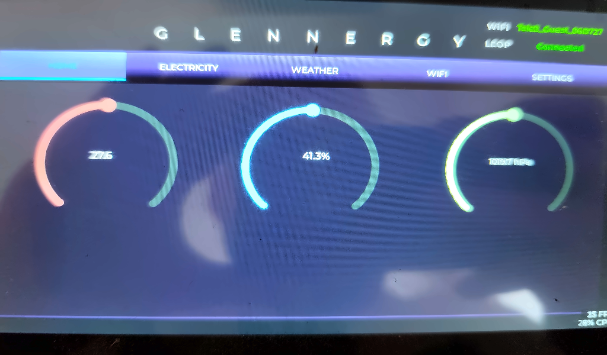
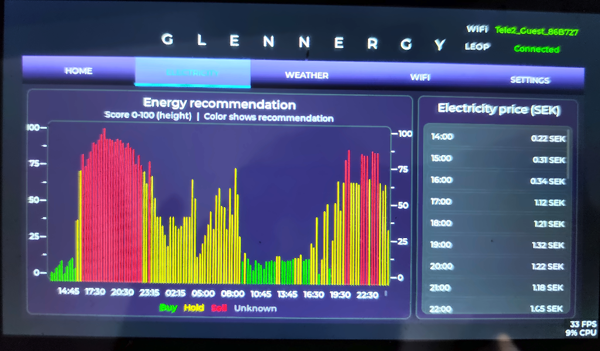
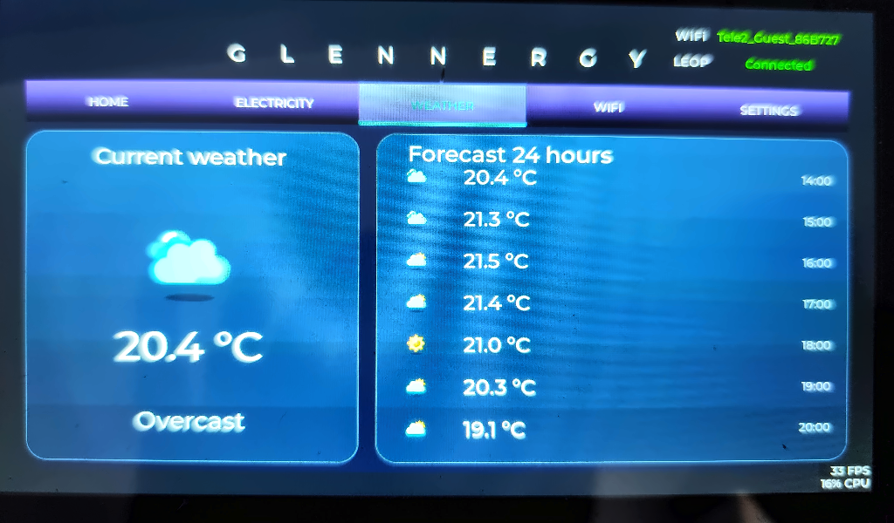
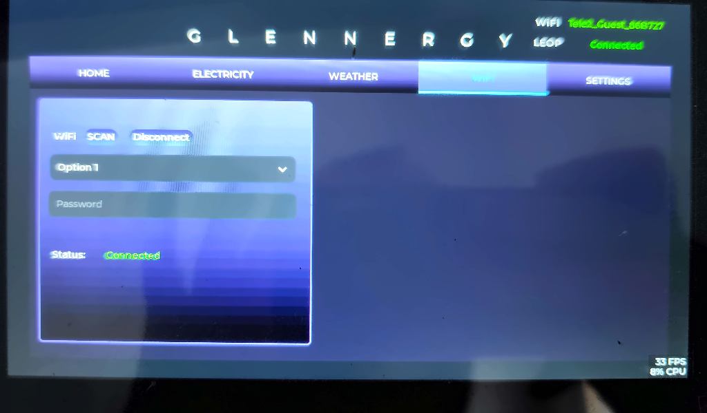
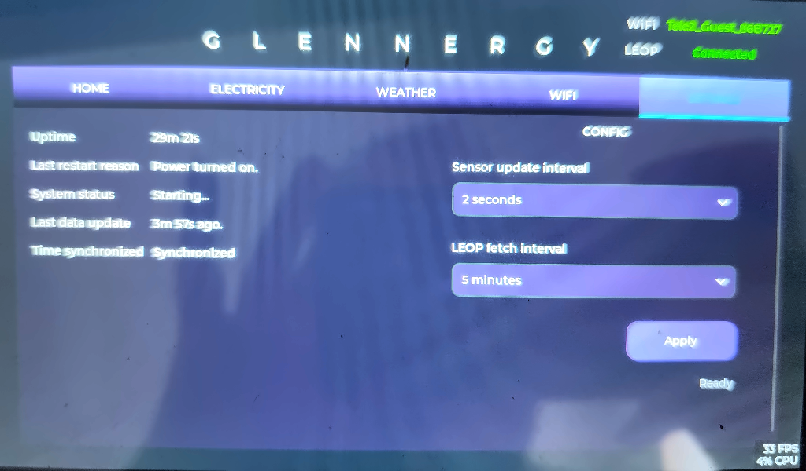

# Glennergy visual user guide

This guide explains the touchscreen without requiring programming knowledge.
Tap a tab along the top to move between the five screens.

> These are corrected photographs of a real Glennergy display. The photographs
> were rotated, perspective-corrected, cropped to 1024 × 600, lightly denoised,
> and sharpened. No UI elements, text, values, dimensions, or network names were
> regenerated or replaced. Live readings and status values will naturally
> differ on another device or at another time.

## At a glance

| Screen | What it is for | What remains after a restart |
| --- | --- | --- |
| Home | Current temperature, humidity, and air pressure | Readings are measured again; they are not saved as history |
| Electricity | Today's price-based buy, hold, or sell recommendation | Server data may be reused from the local cache |
| Weather | Current conditions and the next 24 hours | Server data may be reused from the local cache |
| WiFi | Scan, connect, and disconnect | A successfully connected network and password are saved in NVS |
| Settings | Device status and update intervals | Applied intervals are saved in NVS |

NVS is the ESP32's persistent settings storage. Information saved there normally
survives a restart or loss of power.

## Status messages

- **Connected** means a connection currently exists. It does not guarantee that
  every displayed value was updated at the same moment.
- **Reconnecting** means the device is trying to restore Wi-Fi.
- **Disconnected** or **Not connected** means live server updates cannot arrive.
  Previously displayed or cached server data can still remain visible.
- If only part of a server update succeeds, the successful screen can update
  while another screen keeps its older data.

## Home

The three gauges show measurements from the sensor connected directly to the
device: temperature, relative humidity, and air pressure. This screen does not
need the Glennergy server, although the clock and connection labels still rely
on other services.

- **Success:** the gauges receive new sensor readings at the configured sensor
  interval.
- **Sensor failure:** no new reading replaces the last usable values; the
  device continues running and tries again later.
- **No Wi-Fi:** local sensor measurements can continue. Electricity and weather
  updates may instead use older cached data.

The current sensor interval is configurable on the Settings screen. Individual
Home readings are not stored as a persistent measurement history.

## Electricity

The chart combines electricity-price information with Glennergy's calculated
recommendation. The colors mean **Buy** (green), **Hold** (yellow), **Sell**
(red), or **Unknown** when no usable recommendation is available. The price list
on the right shows hourly prices.

- **Success:** the recommendation, chart, and prices are replaced by newly
  received server data.
- **Partial failure:** one part can update while another keeps its previous
  values.
- **No connection:** the device may show its last cached server response. The
  screen does not currently label cached data separately from fresh data.

How often the device asks the server for new data is controlled by **LEOP fetch
interval** on the Settings screen and stored in NVS after Apply succeeds.

## Weather

The large card shows the current weather. The list beside it shows the upcoming
24-hour forecast with times, icons, and temperatures.

- **Success:** current conditions and the forecast are refreshed from the
  Glennergy server.
- **Failed update:** the last usable weather can remain on screen while the
  device retries later.
- **No connection:** cached weather may be shown, but it is not visually marked
  as cached or stale.

Weather uses the same configurable LEOP fetch interval as Electricity.

## WiFi

Use **SCAN** to search for nearby networks, choose one from the list, enter its
password, and connect. Use **Disconnect** to leave the current network. The
status line reports the current Wi-Fi state.

- Credentials are written to NVS only after the device successfully obtains a
  network connection.
- A saved network is used for reconnect attempts after a restart or temporary
  signal loss.
- A failed connection does not replace the previously saved credentials.
- The password is sensitive. Do not include it in screenshots, logs, issues, or
  documentation.

## Settings

The left side provides quick device information:

- **Uptime:** time since the last restart.
- **Last restart reason:** why the device most recently restarted.
- **System status:** currently a partial placeholder, not a complete health
  diagnosis.
- **Last data update:** age of the last successful recommendation update; it
  does not prove that weather and prices are equally fresh.
- **Time synchronized:** whether network time synchronization has succeeded.

The right side controls how often the local sensor is read and how often LEOP
server data is requested. Select the desired presets and tap **Apply**. The
device saves the settings to NVS and then uses them at runtime. A save error can
leave only part of a multi-setting change stored, so check the on-screen result
after applying changes.

## When something looks wrong

First check the Wi-Fi and LEOP labels at the top, then check **Last data update**
and **Time synchronized** under Settings. Restarting is not normally required:
the device automatically retries sensor reads, Wi-Fi reconnection, and later
server fetches. For deeper diagnosis, continue with the technical
[troubleshooting guide](troubleshooting.md).
